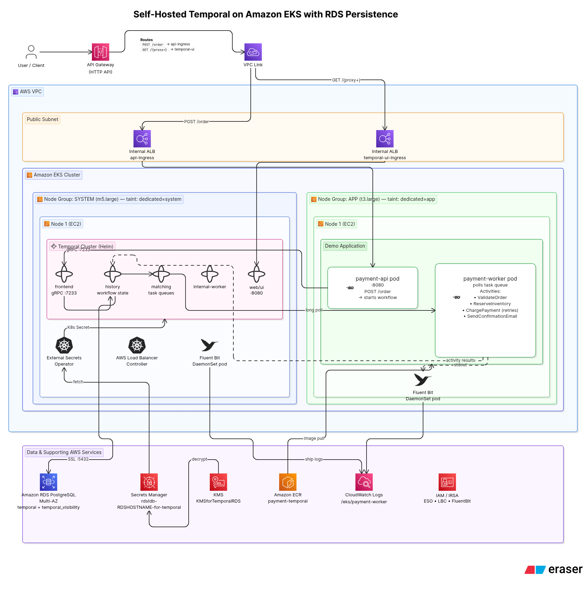

# Self-Hosted Temporal on Amazon EKS with RDS Persistence

A production-grade deployment of **Temporal.io** on **Amazon EKS**, using **Amazon RDS PostgreSQL** as the durable persistence layer — validated through a fault-tolerant **Order Processing** demo workflow written in Go.

---

## Table of Contents

- [Overview](#overview)
- [Demo Application](#demo-application)
- [Project Structure](#project-structure)
- [Prerequisites](#prerequisites)
- [Phase 1 — Infrastructure Setup](#phase-1--infrastructure-setup)
- [Phase 2 — Temporal Setup](#phase-2--temporal-setup)
- [Phase 3 — Demo Application Deployment](#phase-3--demo-application-deployment)
- [Phase 4 — Making API and Temporal UI Reachable](#phase-4--making-api-and-temporal-ui-reachable)
- [Phase 5 — Testing and Observing Workflow Execution](#phase-5--testing-and-observing-workflow-execution)
- [Phase 6 — Logging to CloudWatch via Fluent Bit](#phase-6--logging-to-cloudwatch-via-fluent-bit)
- [Docker — Multi-Stage Build](#docker--multi-stage-build)
- [Architecture Diagram Prompt](#architecture-diagram-prompt)

---

## Overview

This project demonstrates how to:

- Run a **fully self-hosted Temporal cluster** on EKS (frontend, history, matching, worker, UI services)
- Persist all **workflow execution state and visibility data** in Amazon RDS PostgreSQL (Multi-AZ)
- Securely manage **RDS credentials** using AWS Secrets Manager + KMS, injected into the cluster via the External Secrets Operator (ESO)
- Expose the **Order API** and **Temporal UI** publicly through API Gateway + VPC Link + internal ALB
- Ship **worker logs** to CloudWatch via Fluent Bit running as a DaemonSet

### AWS Services Used
`EKS` · `RDS (PostgreSQL)` · `ECR` · `ALB` · `API Gateway` · `Secrets Manager` · `KMS` · `IAM / IRSA` · `CloudWatch` · `EC2`

### External Tools Used
`Temporal` · `External Secrets Operator (ESO)` · `Fluent Bit` · `AWS Load Balancer Controller`

---

## Demo Application

An **Order Processing Workflow** written in Go that orchestrates four sequential activities:

```
START
 │
 ▼  Activity: ValidateOrder
    • Check item availability (mock)
    • Retry: max 3 attempts, backoff 2s
 │
 ▼  Activity: ReserveInventory
    • Deduct stock (mock DB write)
    • Heartbeat every 2s
    • Retry: max 5 attempts, backoff 5s
 │
 ▼  Activity: ChargePayment
    • Simulate payment gateway (INTENTIONALLY FAILS 50% of calls)
    • Retry: max 3 attempts, backoff 10s  ← demonstrates automatic retry
 │
 ▼  Activity: SendConfirmationEmail
    • Logs "email sent" to stdout
 │
 ▼  COMPLETE — returns OrderID + status
```

The `ChargePayment` activity intentionally fails 50% of the time to demonstrate Temporal's automatic retry mechanism. `ReserveInventory` emits heartbeats every 2 seconds to showcase long-running activity supervision. No manual retry code, no lost state, no broken chains.

---

## Project Structure

```
LearningTemporal/
│
├── cmd/
│   ├── api/
│   │   └── main.go               # HTTP server — exposes POST /order to trigger workflow
│   ├── starter/                  # Standalone workflow starter (local testing)
│   └── worker/
│       └── main.go               # Worker binary — registers workflow + activities, polls task queue
│
├── internal/
│   ├── config/
│   │   └── config.go             # Env-based config loader (TEMPORAL_HOST, PORT)
│   └── order/
│       ├── activities/
│       │   ├── chargePayment.go      # Activity: payment simulation with 50% intentional failure
│       │   ├── reserveInventory.go   # Activity: mock DB write + heartbeat every 2s
│       │   ├── sendConfirmation.go   # Activity: logs "email sent"
│       │   └── validateOrder.go     # Activity: mock item availability check
│       ├── models/
│       │   └── types.go              # Shared types — OrderInput, OrderResult
│       ├── constants.go              # Task queue name, workflow/activity type names
│       ├── service.go                # Business logic helpers
│       └── workflow.go               # Workflow definition — orchestrates all 4 activities
│
├── temporal/
│   ├── client.go                 # Temporal client factory (connects to frontend via gRPC)
│   ├── options.go                # Retry policy + activity option builders
│   └── worker.go                 # Worker setup — registers workflow and all activities
│
├── k8s/
│   ├── aws-loadBalancer-controller/
│   │   └── aws-lb-cont-values.yaml       # Helm values for AWS LBC
│   ├── fluentbit/
│   │   └── fluentbit-values.yaml         # DaemonSet config — filter worker logs → CloudWatch
│   ├── temporalValues/
│   │   └── minimalVal.yaml               # Helm values for Temporal — RDS persistence config
│   ├── api-ingress-internal.yaml         # Internal ALB ingress for payment-api
│   ├── api-service.yaml                  # ClusterIP service for payment-api
│   ├── clustersecretstore.yaml           # ESO ClusterSecretStore — points to AWS Secrets Manager
│   ├── dbinitjob.yaml                    # (Optional) DB init job
│   ├── externalSecret.yaml               # ESO ExternalSecret — syncs RDS creds into K8s secret
│   ├── global-bundle.pem                 # AWS RDS TLS CA bundle
│   ├── sa-LBController.yaml              # Service account for AWS Load Balancer Controller
│   ├── temporal-ui-ingress-internal.yaml # Internal ALB ingress for Temporal UI
│   └── worker-api-deployment.yaml        # Deployment for payment-api + payment-worker pods
│
├── pkg/                          # Shared utilities
├── .env                          # Local env vars (not committed)
├── .dockerignore
├── Dockerfile                    # Multi-stage build — produces api and worker binaries
├── go.mod
├── go.sum
└── readme.md
```

---

## Prerequisites

- AWS CLI configured with sufficient IAM permissions
- `kubectl`, `eksctl`, `helm` installed
- Docker installed and authenticated to ECR
- An existing EKS cluster (or follow Phase 1 to create one)

---

## Phase 1 — Infrastructure Setup

### 1.1 EKS Cluster Access

Configure CLI access and verify correct IAM identity:

```bash
aws sts get-caller-identity
aws eks update-kubeconfig --name PaymentsWorkflow --region us-east-1
kubectl config get-contexts
kubectl config use-context arn:aws:eks:us-east-1:<account-id>:cluster/PaymentsWorkflow
```

Add the IAM user to EKS access entries:
> EKS Console → Access → IAM Access Entries → Create → Select IAM user → Type: Standard → Policy: `AmazonEKSClusterAdminPolicy`

### 1.2 Node Groups

Two node groups are created with dedicated labels and taints:

| Node Group | Instance Type | Label              | Taint                         | Purpose                                         |
|------------|---------------|--------------------|-------------------------------|-------------------------------------------------|
| `app`      | t3.large      | `nodegroup=app`    | `dedicated=app:NoSchedule`    | Demo app pods (payment-api, payment-worker)     |
| `system`   | m5.large      | `nodegroup=system` | `dedicated=system:NoSchedule` | Temporal, Fluent Bit, AWS LBC pods              |

Verify:
```bash
kubectl get nodes -L nodegroup
```

---

## Phase 2 — Temporal Setup

### 2.1 RDS Creation + Credentials Management

**Create a KMS key** to encrypt RDS secrets:
> AWS Console → KMS → Create Key → Alias: `KMSforTemporalRDS`

**Create RDS PostgreSQL instance:**
- Enable **Managed in AWS Secrets Manager** during creation
- Select the KMS key created above
- This auto-creates a secret in Secrets Manager (e.g., `rds!db-<identifier>`)

**Create a separate secret for the RDS hostname:**
> AWS Secrets Manager → Store a new secret → Key: `RDSHOST` → Value: `<your-rds-endpoint>`
> Secret name: `RDSHOSTNAME-for-temporal`

### 2.2 External Secrets Operator (ESO)

ESO bridges AWS Secrets Manager and Kubernetes — syncing RDS credentials and config securely into the cluster as native K8s secrets, avoiding any hardcoded sensitive values in manifests or Helm charts.

**A) Install ESO on system node:**
```bash
helm install external-secrets external-secrets/external-secrets \
  -n external-secrets \
  --create-namespace \
  --set tolerations[0].key=dedicated \
  --set tolerations[0].operator=Equal \
  --set tolerations[0].value=system \
  --set tolerations[0].effect=NoSchedule
```

ESO installs three pods:
- `external-secrets` — reads from AWS Secrets Manager (this pod's service account needs IRSA)
- `external-secrets-cert-controller` — manages TLS certs for the webhook
- `external-secrets-webhook` — admission validation webhook

**B) IRSA for ESO:**

Enable OIDC provider:
```bash
eksctl utils associate-iam-oidc-provider \
  --cluster PaymentsWorkflow \
  --approve
```

Create IAM service account with permission to read from Secrets Manager:
```bash
eksctl create iamserviceaccount \
  --name external-secrets \
  --namespace external-secrets \
  --cluster PaymentsWorkflow \
  --attach-policy-arn arn:aws:iam::<account-id>:policy/ESO-AWS-SecretManager-PermissionforTemporalRDS \
  --approve \
  --override-existing-serviceaccounts
```

> The IAM policy grants `secretsmanager:GetSecretValue`, `secretsmanager:DescribeSecret`, and `kms:Decrypt` scoped to the specific RDS secret ARN and KMS key ARN.

Restart ESO to pick up the updated service account annotation:
```bash
kubectl rollout restart deployment external-secrets -n external-secrets
```

### 2.3 K8s Secret Object Setup

Three objects work together to bring the secret into the cluster:

| Object               | Scope        | Purpose                                                                 |
|----------------------|--------------|-------------------------------------------------------------------------|
| `ClusterSecretStore` | Cluster-wide | Tells ESO which service account to use to authenticate to AWS SM        |
| `ExternalSecret`     | Namespaced   | Sync instruction — which secret to fetch and which K8s secret to create |
| `K8s Secret`         | Namespaced   | Actual secret object in etcd, consumed by Temporal pods                 |

**A) ClusterSecretStore:**
```bash
kubectl apply -f k8s/clustersecretstore.yaml
```

**B) ExternalSecret:**
```bash
kubectl apply -f k8s/externalSecret.yaml
```

The ExternalSecret syncs three keys — `username`, `password`, and `RDSHOST` — from Secrets Manager into a K8s secret named `temporal-rds-secret` in the `temporal` namespace, refreshed every 1 hour.

Verify:
```bash
kubectl get externalsecret -n temporal
kubectl get secret temporal-rds-secret -n temporal
```

### 2.4 Temporal Installation via Helm

The `k8s/temporalValues/minimalVal.yaml` configures Temporal to:
- Use RDS PostgreSQL for both `default` (execution state) and `visibility` (search metadata) stores
- Read DB credentials from the `temporal-rds-secret` K8s secret
- Force SSL (`sslmode: require`) for RDS connections
- Run all Temporal pods on the `system` node group via tolerations
- Create a `default` Temporal namespace with 3-day workflow history retention

```bash
helm install temporal temporal/temporal \
  -n temporal \
  -f k8s/temporalValues/minimalVal.yaml
```

Verify all pods are running on the system node:
```bash
kubectl get pods -n temporal -o wide
```

---

## Phase 3 — Demo Application Deployment

Two deployments from a single Docker image, differentiated by the `args` passed at runtime:

| Deployment        | Args       | Role                                                                 |
|-------------------|------------|----------------------------------------------------------------------|
| `payment-api`     | `["api"]`  | HTTP server on :8080 — POST `/order` triggers workflow execution     |
| `payment-worker`  | `["worker"]` | Long-polls Temporal task queue, executes workflow + activity tasks |

Both pods run on the `app` node group and connect to Temporal frontend via:
```
temporal-frontend.temporal.svc.cluster.local:7233
```

### Build and Push to ECR

```bash
# Build
docker build --network=host -t learning-temporal .

# Tag
docker tag learning-temporal:latest <account-id>.dkr.ecr.us-east-1.amazonaws.com/payment-temporal:1.7

# Authenticate
aws ecr get-login-password --region us-east-1 | \
  docker login --username AWS --password-stdin <account-id>.dkr.ecr.us-east-1.amazonaws.com

# Push
docker push <account-id>.dkr.ecr.us-east-1.amazonaws.com/payment-temporal:1.7
```

### Deploy

```bash
kubectl apply -f k8s/worker-api-deployment.yaml
kubectl get pods -o wide
```

Confirm API is running:
```bash
kubectl logs <payment-api-pod>
# Expected: API running on : :8080
```

---

## Phase 4 — Making API and Temporal UI Reachable

All services are in private subnets. Public access is achieved through:
**API Gateway (HTTP API) → VPC Link → Internal ALB (created by Ingress) → K8s Service → Pod**

### 4.1 AWS Load Balancer Controller

The AWS LBC watches Ingress objects and provisions ALBs accordingly.

IRSA setup — create IAM role with `AWSLoadBalancerControllerPolicy`, add OIDC trust relationship scoped to the `aws-load-balancer-controller` service account in `kube-system`.

Install:
```bash
helm install aws-load-balancer-controller eks/aws-load-balancer-controller \
  -n kube-system \
  -f k8s/aws-loadBalancer-controller/aws-lb-cont-values.yaml
```

### 4.2 Internal Ingress for Payment API

```bash
kubectl apply -f k8s/api-service.yaml           # ClusterIP service
kubectl apply -f k8s/api-ingress-internal.yaml   # Internal ALB ingress
kubectl get ingress                              # Confirms ALB DNS
```

### 4.3 Internal Ingress for Temporal UI

```bash
kubectl apply -f k8s/temporal-ui-ingress-internal.yaml
kubectl get ingress -n temporal
```

### 4.4 API Gateway

1. Create a **VPC Link** pointing to the VPC subnets of the EKS cluster
2. Create an **HTTP API** in API Gateway
3. Add routes and integrations:

| Route            | Integration Target              | Notes                                     |
|------------------|---------------------------------|-------------------------------------------|
| `POST /order`    | Internal ALB (api-ingress)      | Triggers workflow execution               |
| `GET /{proxy+}`  | Internal ALB (temporal-ui-ingress) | Catch-all for Temporal UI routing      |

> `{proxy+}` matches all sub-paths including `/namespaces`, `/namespaces/default/workflows`, etc.

---

## Phase 5 — Testing and Observing Workflow Execution

### Trigger a Workflow

Send a POST request via API Gateway:

```bash
curl -X POST https://<api-gateway-id>.execute-api.us-east-1.amazonaws.com/order \
  -H "Content-Type: application/json" \
  -d '{"orderId": "Demo-1.0break"}'
```

Expected response:
```json
{
  "orderId": "Demo-1.0break",
  "runId": "<run-id>",
  "status": "accepted",
  "workflowId": "order-Demo-1.0break"
}
```

### Observe in Temporal UI

Visit the Temporal UI via API Gateway `GET /` route. You should see:
- Workflow status: `Completed`
- Timeline showing all 4 activities executed sequentially
- Event history with retry attempts on `ChargePayment`
- Input / Result values on the workflow detail page

---

## Phase 6 — Logging to CloudWatch via Fluent Bit

Fluent Bit runs as a **DaemonSet** across all nodes. It is configured to:
- Watch only `payment-worker` pod logs from `/var/log/containers/`
- Enrich logs with Kubernetes metadata
- Ship to CloudWatch log group `/eks/payment-worker` with stream prefix `fluentbit-`

### IRSA for Fluent Bit

```bash
eksctl create iamserviceaccount \
  --name fluent-bit \
  --namespace logging \
  --cluster PaymentsWorkflow \
  --attach-policy-arn arn:aws:iam::<account-id>:policy/cloudwatchFluentbitIAM \
  --approve \
  --override-existing-serviceaccounts
```

> IAM policy grants `logs:CreateLogGroup`, `logs:CreateLogStream`, `logs:PutLogEvents`, `logs:DescribeLogStreams`.

### Install Fluent Bit

```bash
helm install fluent-bit fluent/fluent-bit \
  -n logging \
  -f k8s/fluentbit/fluentbit-values.yaml
```

Verify:
```bash
kubectl get pods -n logging
kubectl logs <fluent-bit-pod> -n logging
```

Check CloudWatch:
> AWS Console → CloudWatch → Log Groups → `/eks/payment-worker`

---

## Docker — Multi-Stage Build

The `Dockerfile` uses a two-stage build to keep the final image minimal:

**Stage 1 (Builder):** Uses `golang:1.26-alpine` to compile both `api` and `worker` binaries with CGO disabled for a fully static binary.

**Stage 2 (Runtime):** Uses `alpine:3.21` with only `ca-certificates` and `tzdata` added. No Go toolchain is included in the final image.

The same image runs both binaries — the container's behaviour is controlled by the `args` passed in the K8s deployment spec:
- `args: ["api"]` → runs the HTTP server
- `args: ["worker"]` → runs the Temporal worker

```bash
# Run API locally
docker run -e TEMPORAL_HOST=localhost:7233 -e PORT=:8080 learning-temporal api

# Run Worker locally
docker run -e TEMPORAL_HOST=localhost:7233 learning-temporal worker
```

---

## Architecture Diagram Prompt

Use the following description to generate a clean architecture diagram in any diagram tool (Excalidraw, Lucidchart, draw.io, Eraser.io, etc.):

---


ARCHITECTURE: Self-Hosted Temporal on Amazon EKS with RDS Persistence

